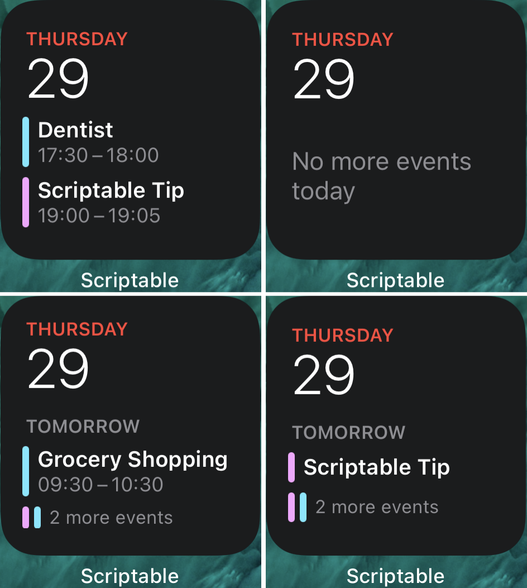
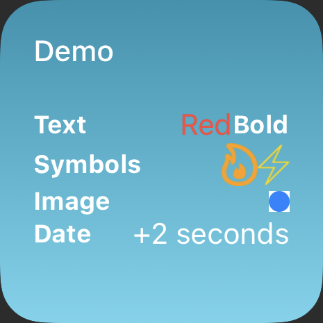

Scriptable Widgets using JSX-like syntax
==== 

This is using [htm](https://github.com/developit/htm) tagged-template JSX-like syntax in plain JavaScript to create widgets 
in [Scriptable](https://scriptable.app/). 


## Gettings Started:
Basic structure of a widget: 

```js
const widget = render`
  <ListWidget> 
    <Text color=${Color.blue()}>Hello World</Text>
  </ListWidget>
`;

// Library code omitted...
```

## Examples

### Apple Calendar Widget 


  
[Source Code](examples/AppleCalenderWidget.js)

### Showcase


  
[Source Code](examples/Showcase.js)


## Build-in Elementes:

### `ListWidget`

See Scriptable docs for [available attributes](https://docs.scriptable.app/listwidget/)

### `Text`

See Scriptable docs for [available attributes](https://docs.scriptable.app/textwidget/)
In addition you can use these aliases too:
```
color => 'textColor'
opacity => 'textOpacity'
center => 'centerAlignText'
left => 'leftAlignText'
right => 'rightAlignText'
```


### `Stack`
See Scriptable docs for [available attributes](https://docs.scriptable.app/stackwidget/)
In addition you can use these aliases too:
```
vertical => 'layoutVertically'
horizontal => 'layoutHorizontally'
```

### `VStack`
Convenience element for `<Stack vertical />`

### `VStack`
Convenience element for `<Stack horizontal />`

### `Spacer`
See Scriptable docs for [available attributes](https://docs.scriptable.app/spacerwidget/)

### `Image`
See Scriptable docs for [available attributes](https://docs.scriptable.app/imagewidget/)
In addition you can use these aliases too:
```
size => 'imageSize'
opacity => 'imageOpacity'
fill  => 'applyFillingContentMode'
fitting  => 'applyFittingContentMode'
center  => 'centerAlignImage'
left  =>'leftAlignImage'
right  => 'rightlignImage'
```

### `Symbol`

Convenience element for putting an SFSymbol into an image.`<Symbol name="[Symbol Name]" />`
The attributes `bold, black, heavy, light, medium, regular, semibold, thin, ultralight` will be mapped
to the corresponding `apply[name]Weight` function. 
The attribute `color` will be applied as the `tintColor` of the image
